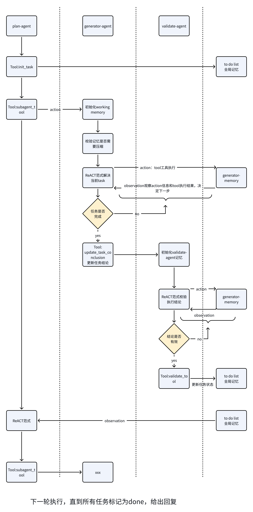

<h1 align="center">self-harness - 实战指南（⚠️ Alpha内测）</h1>

<p align="center">
  
</p>

<p align="center">
  <a href="https://github.com/datawhalechina/self-harness/stargazers">
    
  </a>
  <a href="https://github.com/datawhalechina/self-harness/network/members">
    
  </a>
  <br>
  <a href="https://github.com/datawhalechina/self-harness">
    
  </a>
  <a href="https://datawhalechina.github.io/self-harness/">
    
  </a>
  <br>
  <a href="http://creativecommons.org/licenses/by-nc-sa/4.0/">
    
  </a>
</p>

> [!CAUTION]
> ⚠️ Alpha内测提醒：项目内容仍在持续完善中，可能存在错误或缺漏，欢迎大家提 Issue 反馈问题或建议。


## 项目简介

本项目是一本关于 **Harness Engineering** 的开源教程，旨在帮助开发者理解和掌握在大模型时代，如何为复杂、长时间运行的 AI 智能体（Agent）构建健壮的底层运行架构。

随着智能体技术的发展，AI 系统的开发范式正在经历深刻的演进：从单次的提示词工程（Prompt Engineering），到动态信息管理的上下文工程（Context Engineering），最终迈向系统级的 Harness Engineering。

本教程包含理论讲解和实践代码两部分：
- **理论部分**：系统介绍提示词工程、上下文工程、harness 的核心概念、设计原则、实现策略。以及为什么会一步步演进到 harness engineering
- **实践部分**：通过 miniMaster 项目（一个最小化的 Harness 实现），展示如何将 Harness 理论应用于实际开发

## 项目受众

本教程适合以下人群：
- **AI 应用开发者**：希望构建更复杂、更智能的 AI 应用系统
- **大模型技术爱好者**：想深入了解 Agent 系统和上下文管理机制
- **Python 开发者**：具备基础 Python 编程能力，想学习 AI 系统工程化实践

通过学习本教程，你将能够：
- 理解上下文工程与提示词工程的本质区别
- 掌握动态上下文管理的核心策略
- 学会设计可扩展的 AI 技能系统
- 动手实现一个最小化的类 Claude Code 系统

## 在线阅读

📖 [https://datawhalechina.github.io/self-harness/](https://datawhalechina.github.io/self-harness/)

## 目录

| 章节名 | 简介 | 状态 |
| :--- | :--- | :--- |
| [第1章 总览](https://github.com/datawhalechina/self-harness/blob/main/docs/chapter1/overview.md) | 总览 | ✅ |
| [第2章 什么是提示词工程](https://github.com/datawhalechina/self-harness/blob/main/docs/chapter2/prompt_engineering.md) | Prompt Engineering 的概念、方法、局限性 | ✅ |
| [第3章 什么是上下文工程](https://github.com/datawhalechina/self-harness/blob/main/docs/chapter3/context_engineering.md) | 上下文工程的概念和方法 | ✅ |
| [第4章 长时运行下的 Harness Engineering](https://github.com/datawhalechina/self-harness/blob/main/docs/chapter4/harness_engineering.md) | 再长时间复杂软件开发中、如何设计 harness 以保证 agent 在长时间的运行中不会出错 | ✅ |
| [第5章 三种工程的演进](https://github.com/datawhalechina/self-harness/blob/main/docs/chapter5/evolution.md) | 这三种工程理论的演进 | ✅ |
| [第6章 miniMaster 实战项目](https://github.com/datawhalechina/self-harness/blob/main/docs/chapter6/miniMaster.md) | 围绕 miniMaster 实例讲清 Tool 设计、Prompt/动作协议、动态工作记忆、验证闭环与三层智能体协作方式 | ✅ |

## miniMaster 实战项目

miniMaster 是本教程配套的最小 Harness 实践项目，代码目录位于 [`code/miniMaster2.0/`](code/miniMaster2.0/)。
它把任务建模、Prompt 构造、动作协议、运行时记忆、验证闭环和工具系统拆成清晰模块，便于理解一个可持续运行的 Agent 系统到底由哪些部件组成。

### 核心特性

- **系统 Tool 设计**：包含基础系统工具（Bash、Read、Write、Edit）和搜索检索工具（Glob、Grep），并通过 `tools/core` 中的 `ToolContext + ToolSpec + ToolService` 统一管理
- **Prompt 与动作协议**：将 Prompt 构造、角色动作策略和原生 function call 协议拆分到 `llm/prompting/` 中，保证 Prompt 描述与动作边界一致
- **动态工作记忆管理**：把 `planner_memory`、`generator_memory`、`validation_memory` 与 `retry_archive_by_task` 分开管理，既保留必要上下文，也能压缩旧轨迹
- **三层嵌套循环架构**：Planner-Agent（全局调度）→ Executor-Agent（执行者）→ Validator-Agent（评估者），并配合 completion checklist、重复动作防护和重试归档形成稳定闭环

### 智能体架构图



### 运行示例

query: 分析当前项目中 `memory/` 目录的实际作用，并说明 `planner_memory / generator_memory / validation_memory / retry_archive_by_task` 分别负责什么，以及这套 memory 是否跨重启持久化

部分结果:

plan-agent
```log
📋 Planner-Agent 选择工具: init_tasks
📋 参数: {'tasks': [{'task_name': '分析 memory 目录作用', ...}]}
✅ 已初始化任务列表: [{'task_name': '分析 memory 目录作用', ...}]

📋 Planner-Agent 选择工具: read
📋 参数: {'file_path': 'C:\\Users\\25853\\Desktop\\self-harness\\code\\miniMaster2.0\\bootstrap\\runtime.py'}
✅ 规划侦察结果: {'success': True, 'content': 'import os\\nimport time\\n...'}
📋 Planner-Agent 选择工具: split_task
📋 参数: {'target_task_name': '分析 memory 目录作用', ...}
```
generator-agent
```log
🚀 开始执行任务: 分析 memory 目录作用

  🛠️ Executor-Agent 选择工具: read
  🛠️ 参数: {'file_path': 'bootstrap/runtime.py'}
  ✅ 工具执行结果: {'success': True, 'content': 'import os\\nimport time\\n...', 'total_lines': 107}

  🛠️ Executor-Agent 选择工具: read
  🛠️ 参数: {'file_path': 'memory/prompt_context.py'}
  ✅ 工具执行结果: {'success': True, 'content': 'from __future__ import annotations\\n...', 'total_lines': 115}

  🛠️ Executor-Agent 选择工具: update_task_conclusion
  🛠️ 参数: {'conclusion': 'memory 目录在运行时被直接使用，并参与 Planner、Executor、Validator 的上下文组织。'}
```
validate-agent
```log
    🛠️ Validator-Agent 选择工具: grep
    🛠️ 参数: {'pattern': 'from memory.prompt_context import', 'path': 'engine/validator.py', 'recursive': False}
    ✅ 验证工具执行结果: {'success': True, 'matches': [{'file': 'engine\\validator.py', 'line_number': 18, 'line_content': 'from memory.prompt_context import build_validator_prompt_context', 'matched_text': 'from memory.prompt_context import'}]}

    🛠️ Validator-Agent 选择工具: validate_tool
    🛠️ 参数: {'status': '有效', 'reason': '现有证据已完整覆盖所有完成项：validator 通过 build_validator_prompt_context 获取验证所需的 memory 上下文。', 'covered_requirements': ['能够说明 validator 是否使用 memory 数据及其使用方式', '验证器与 memory 关联分析报告'], 'missing_requirements': []}
    ✅ 验证通过！
```

最终生成的分析结果：[生成的结果](code/miniMaster2.0/use_case/case3/res.md)

### 完整日志

[查看完整执行日志](code/miniMaster2.0/use_case/case3/log.txt)

### 代码结构

```text
code/miniMaster2.0/
├── bootstrap/
│   ├── runtime.py          # 启动装配：LLM client、ToolService、memory、skill store
│   └── stage_context.py    # 统一构造 system prompt、动作集合与 tool schema
├── domain/
│   ├── todo.py             # 任务列表与任务卡片管理
│   ├── task_requirements.py# 把 done_when / deliverable 归一成 completion checklist
│   ├── state_machine.py    # 受控任务状态迁移
│   └── types.py            # Task、AgentRuntime、MemoryEntry 等核心数据结构
├── engine/
│   ├── main_loop.py        # 顶层 Planner 主循环
│   ├── plan_actions.py     # init_tasks / split_task / retry_task / subagent_tool 处理
│   ├── runner.py           # Executor 执行与任务重试
│   ├── validator.py        # Validator 独立验证循环
│   ├── guards.py           # 重复动作防护
│   └── support.py          # 日志、反馈与运行时工具辅助
├── llm/
│   ├── runner.py           # 模型请求入口与 function call 解析
│   └── prompting/
│       ├── builders.py     # Plan / Executor / Validator Prompt 构造
│       ├── policies.py     # 三个角色的动作白名单
│       └── protocol.py     # function call 协议适配
├── memory/
│   ├── prompt_context.py   # 按角色整理 prompt 所需的 memory 视图
│   ├── session.py          # session memory 与 retry archive 管理
│   └── working_memory.py   # 工作记忆记录、裁剪、压缩与渲染
├── skills/
│   ├── store.py            # skill 包解析与加载
│   ├── types.py            # Skill 数据结构
│   ├── library/            # 示例 skills
│   └── scripts/            # skill 相关脚本
├── tools/
│   ├── base_tool/          # 基础系统工具
│   ├── search_tool/        # 搜索检索工具
│   └── core/               # ToolContext、ToolSpec、ToolService
├── use_case/               # 运行案例、日志与结果
├── utils/                  # 控制台日志等辅助模块
├── main_agent.py           # 程序入口
└── requirements.txt        # 依赖列表
```

## 贡献者名单

| 姓名 | 职责 | GitHub |
| :--- | :--- | :--- |
| 张文星 | 项目负责人、教程设计与实现 | [@funnamer](https://github.com/funnamer) |
| CaptainUniverse_ | 实践项目部分 代码优化 | [@TheCaptainUniverse](https://github.com/TheCaptainUniverse) |

## 参与贡献

- 如果你发现了一些问题，可以提 Issue 进行反馈，如果提完没有人回复你可以联系[保姆团队](https://github.com/datawhalechina/DOPMC/blob/main/OP.md)的同学进行反馈跟进~
- 如果你想参与贡献本项目，可以提 Pull Request，如果提完没有人回复你可以联系[保姆团队](https://github.com/datawhalechina/DOPMC/blob/main/OP.md)的同学进行反馈跟进~
- 如果你对 Datawhale 很感兴趣并想要发起一个新的项目,请按照[Datawhale开源项目指南](https://github.com/datawhalechina/DOPMC/blob/main/GUIDE.md)进行操作即可~

## 已知待完善

- [ ] 主流的 harness 系统应用的 agent 产品解析（比如 NanoBot、OpenHarness 等）

## 关注我们

<div align="center">
<p>扫描下方二维码关注公众号：Datawhale</p>

</div>

## LICENSE

<a rel="license" href="http://creativecommons.org/licenses/by-nc-sa/4.0/"></a><br />本作品采用<a rel="license" href="http://creativecommons.org/licenses/by-nc-sa/4.0/">知识共享署名-非商业性使用-相同方式共享 4.0 国际许可协议</a>进行许可。
